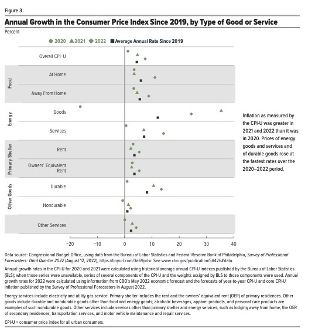

# Critique by design
I have selected an image to critique. 
This graph appeared in a report from the Congressional Budget Office.

The visualization present interesting, truthful and complete data. However, it is not presented in a very intuitive manner: it contains different shapes for different years: so the user’s eyes must travel back and forth to check which year  belongs with which shape. Additionally, it is not very clear why the grey area means in the context of this graph. 
Although the main message that the authors wanted to convey was that the highest inflation was that of energy goods and services and of durable goods, there is nothing in the graph that highlights them.
In my opinion, in terms of aesthetics, it is a clean graph only using gray and white in the background, without many gridlines, but it could be perceived as slightly busy with many shapes. The graph could also benefit from a better use of color and a more engaging title.

