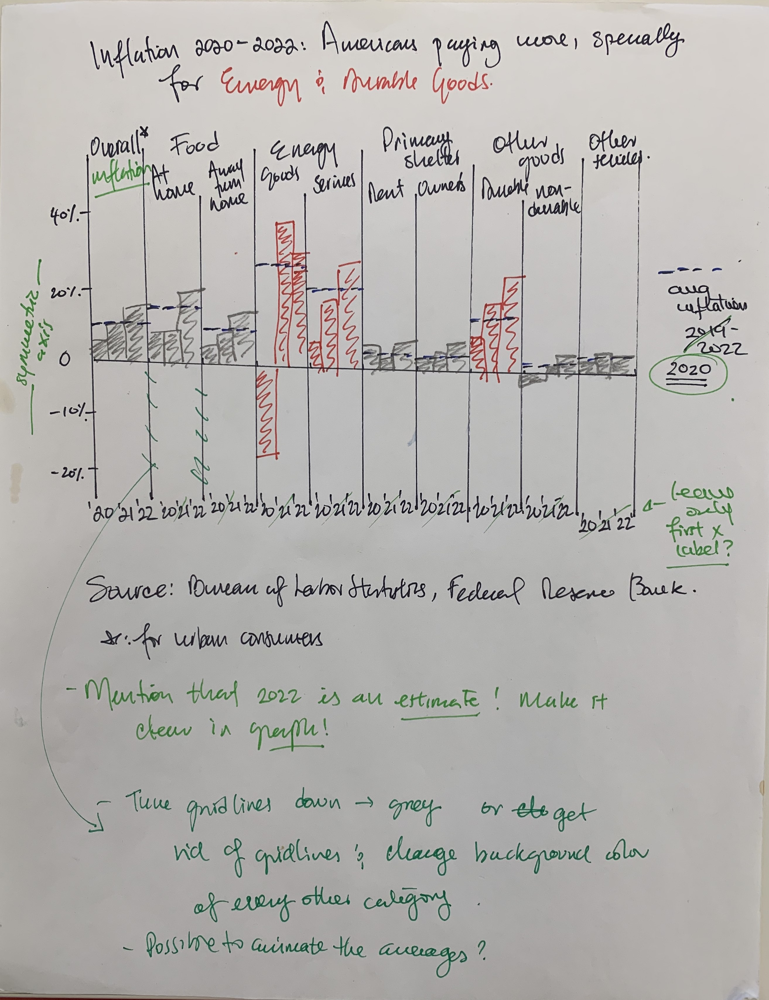
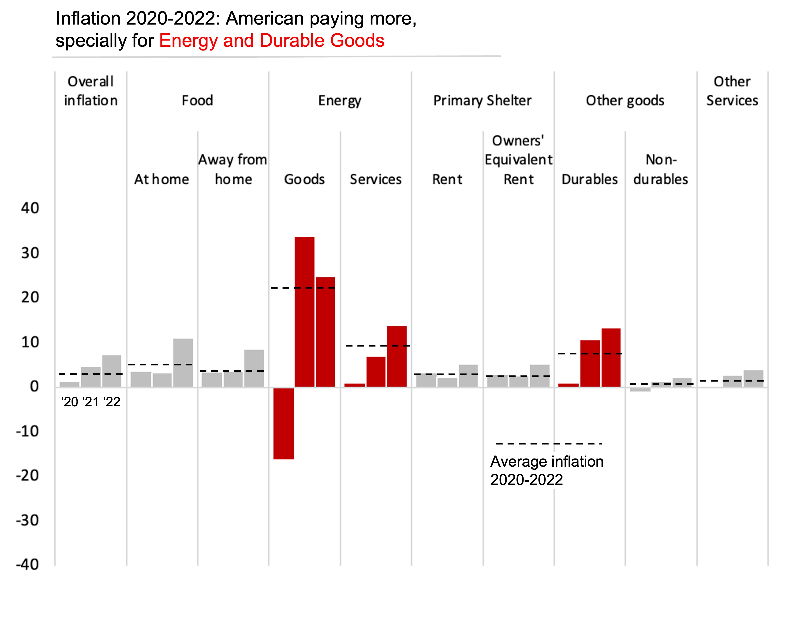

# Critique by design
I have selected an image to critique. 
This graph appeared in a report from the Congressional Budget Office.

The visualization presents interesting, truthful and complete data. However, it is not presented in a very intuitive manner: it contains different shapes for different years: so the user’s eyes must travel back and forth to check which year  belongs with which shape. Additionally, it is not very clear why the grey area means in the context of this graph. 
Although the main message that the authors wanted to convey was that the highest inflation was that of energy goods and services and of durable goods, there is nothing in the graph that highlights them.
In my opinion, in terms of aesthetics, it is a clean graph only using gray and white in the background, without many gridlines, but it could be perceived as slightly busy with many shapes. The graph could also benefit from a better use of color and a more engaging title.

I think the primary audience for this graph are specialists in public finances. In this sense, I think the graph is effective at reaching its audience. However, the materials from the congressional budget reports are oftentimes used for informing “lay people”. If this graphed were presented to someone who is interested in this information but doesn’t have a technical background, then I think it could use some improvements to make it more clear, digestible and engaging.
For example, the use of abbreviations as CPI-U for the labels might be easy to interpret for a general audience. 

I would add a more engaging title, I would rotate the graph so inflation is on the y axis, I would change the graph from shapes to bars graphs, I would also use a dotted line to represent the average instead of a new shape (or bar) 

## Draft with comments

## Comments from surveys
## Some of the comments from the surveys are incluided in the draft as comments in 
# CHANGE COLOR->green

## Final version

